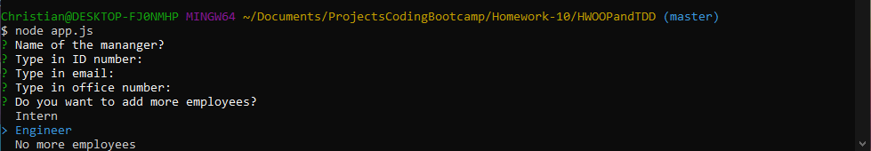

# HWOOPandTDD
## Homework Assignment
This is the homework assignment for "Unit 10 OOP Homework: Template Engine - Employee Summary". We are instructed to:

*"...build a software engineering team generator command line application. The application will prompt the user for information about the team manager and then information about the team members. The user can input any number of team members, and they may be a mix of engineers and interns. This assignment must also pass all unit tests. When the user has completed building the team, the application will create an HTML file that displays a nicely formatted team roster based on the information provided by the user."*
## Description
This is a node application to create a html page from the users inputs. It will ask the user 5 questions, beginning with the manager's information (their name, ID number, Email, and office number). The fifth question will ask the user whether they want to add an **"Intern"**, **"Employee"**, or **"No more Employees"**

If **Intern** is selected, we'll ask the user five questions (their name, ID number, Email, and school name) and ask again whether to add another employee. If **Engineer** is selected, we'll ask the same five questions (their name, ID number, Email and Github username) and ask again if they want to add another employee.

If **No more employees** is selected, the questions will end and the application will generate an html page with the users input. You can access the html page in the output folder (called "team.html"). You can check the example in the output folder.
